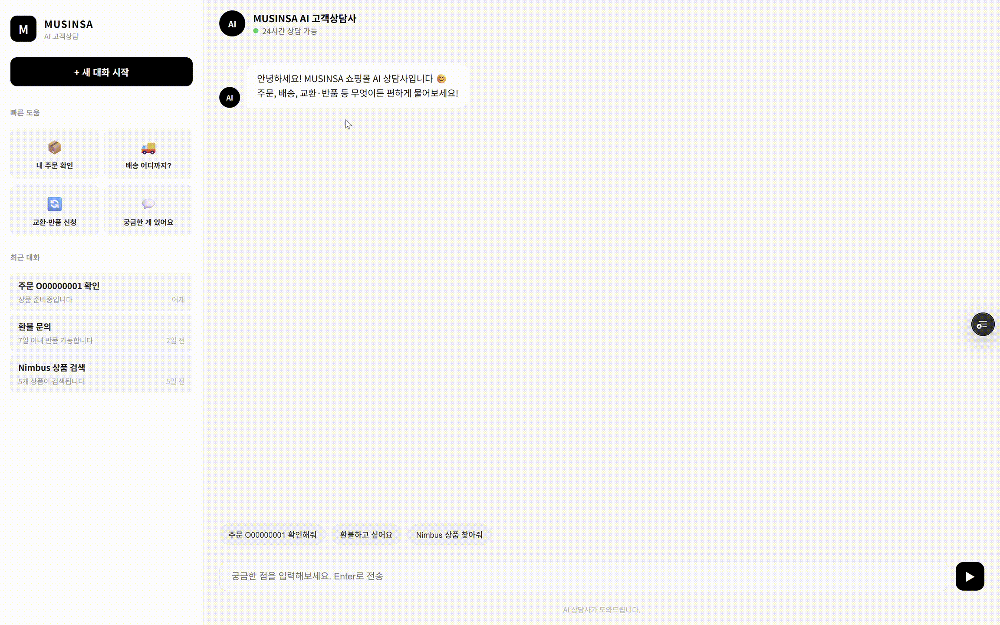
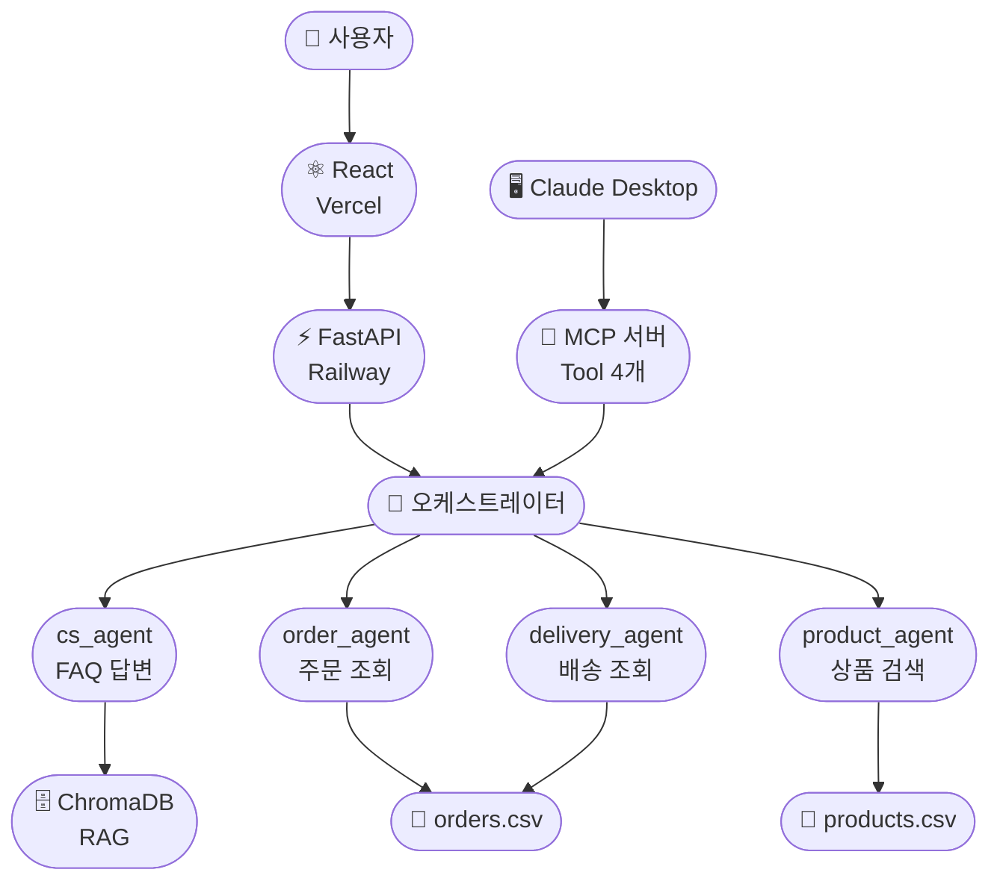
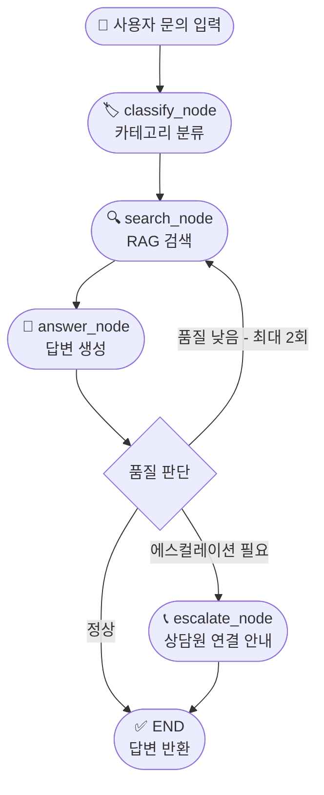

# CS Automation Agent

무신사 FAQ 기반 LangGraph 멀티에이전트 CS 자동화 시스템

[](https://cs-automation-agent-git-main-seunghun-s-projects1.vercel.app/)
[](https://cs-automation-agent-production.up.railway.app)

---

## 목차

- [CS Automation Agent](#cs-automation-agent)
  - [목차](#목차)
  - [프로젝트 개요](#프로젝트-개요)
  - [배포 URL](#배포-url)
  - [시연 영상](#시연-영상)
    - [웹 UI 시연](#웹-ui-시연)
    - [Claude Desktop MCP 시연](#claude-desktop-mcp-시연)
  - [시스템 아키텍처](#시스템-아키텍처)
  - [에이전트 흐름도](#에이전트-흐름도)
  - [주요 기능](#주요-기능)
    - [멀티에이전트 시스템](#멀티에이전트-시스템)
    - [RAG 파이프라인](#rag-파이프라인)
    - [MCP 서버](#mcp-서버)
    - [LangFuse 평가](#langfuse-평가)
  - [기술 스택](#기술-스택)
  - [프로젝트 구조](#프로젝트-구조)
  - [로컬 실행 방법](#로컬-실행-방법)
    - [1. 환경 설정](#1-환경-설정)
    - [2. 환경변수 설정](#2-환경변수-설정)
    - [3. ChromaDB 생성](#3-chromadb-생성)
    - [4. 백엔드 실행](#4-백엔드-실행)
    - [5. 프론트엔드 실행](#5-프론트엔드-실행)
  - [MCP 서버 연결 (Claude Desktop)](#mcp-서버-연결-claude-desktop)
    - [사용 가능한 Tool](#사용-가능한-tool)
  - [평가 결과](#평가-결과)
  - [트러블슈팅](#트러블슈팅)
    - [ChromaDB DLL 오류 (Windows)](#chromadb-dll-오류-windows)
    - [MCP 서버 연결 실패](#mcp-서버-연결-실패)
    - [Railway 배포 시 API 키 오류](#railway-배포-시-api-키-오류)
  - [데이터 출처](#데이터-출처)
  - [개발자](#개발자)

---

## 프로젝트 개요

반복적인 고객 문의를 AI 에이전트로 자동화하여 CS 운영 효율을 높이는 시스템입니다.

- Playwright로 무신사 FAQ 200여건 크롤링
- RAG 파이프라인 (ChromaDB + OpenAI Embedding)으로 관련 FAQ 검색
- LangGraph 기반 멀티에이전트로 문의 유형별 자동 라우팅
- MCP 서버로 Claude Desktop 연동

---

## 배포 URL

| 서비스 | URL |
|--------|-----|
| 프론트엔드 (Vercel) | https://cs-automation-agent-git-main-seunghun-s-projects1.vercel.app/ |
| 백엔드 API (Railway) | https://cs-automation-agent-production.up.railway.app |
| API 문서 (Swagger) | https://cs-automation-agent-production.up.railway.app/docs |

---

## 시연 영상

### 웹 UI 시연


### Claude Desktop MCP 시연


---

## 시스템 아키텍처



---

## 에이전트 흐름도



---

## 주요 기능

### 멀티에이전트 시스템
| 에이전트 | 역할 | 데이터 |
|---------|------|--------|
| cs_agent | FAQ 기반 일반 CS 문의 답변 | ChromaDB (202개 FAQ) |
| order_agent | 주문번호 기반 주문 조회 | orders.csv, order_items.csv |
| product_agent | 상품명/브랜드 기반 상품 검색 | products.csv |
| delivery_agent | 주문번호 기반 배송 상태 조회 | orders.csv |

### RAG 파이프라인
- Playwright로 무신사 FAQ 202개 크롤링 (8개 카테고리)
- OpenAI text-embedding-3-small로 임베딩
- ChromaDB에 벡터 저장 및 유사도 검색

### MCP 서버
- Claude Desktop에 Tool 4개 등록
- Claude가 문의 내용에 따라 적절한 Tool 자율 선택

### LangFuse 평가
- 100개 테스트 케이스 평가
- 에스컬레이션 정확도, 키워드 포함률, 환각 발생률 측정
- Overall Score: 0.893

---

## 기술 스택


---

## 프로젝트 구조

```
CS-automation-agent/
├── src/
│   ├── agent.py              # cs_agent (LangGraph)
│   ├── orchestrator.py       # 멀티에이전트 오케스트레이터
│   ├── mcp_server.py         # MCP 서버 (Tool 4개)
│   ├── api.py                # FastAPI 백엔드
│   ├── config.py             # LLM, VectorStore 설정
│   ├── agent_state.py        # AgentState 정의
│   ├── rag.py                # RAG 파이프라인
│   ├── crawler.py            # Playwright 크롤러
│   ├── node/
│   │   ├── classify_node.py
│   │   ├── search_node.py
│   │   ├── answer_node.py
│   │   └── escalate_node.py
│   └── agents/
│       ├── order_agent.py
│       ├── product_agent.py
│       └── delivery_agent.py
├── frontend/                 # React 프론트엔드
├── data/
│   ├── musinsa_faq.json      # FAQ 데이터 (202개)
│   ├── orders.csv
│   ├── order_items.csv
│   ├── products.csv
│   └── evaluation_results.csv
└── requirements.txt
```

---

## 로컬 실행 방법

### 1. 환경 설정

```bash
git clone https://github.com/seunghun92-lab/CS-automation-agent.git
cd CS-automation-agent
python -m venv venv
venv\Scripts\activate
pip install -r requirements.txt
playwright install
```

### 2. 환경변수 설정

```
OPENAI_API_KEY=your-openai-api-key
LANGFUSE_PUBLIC_KEY=your-langfuse-public-key
LANGFUSE_SECRET_KEY=your-langfuse-secret-key
LANGFUSE_HOST=https://cloud.langfuse.com
```

### 3. ChromaDB 생성

```bash
cd src
python rag.py
```

### 4. 백엔드 실행

```bash
cd src
uvicorn api:app --reload
```

### 5. 프론트엔드 실행

```bash
cd frontend
npm install
npm start
```

---

## MCP 서버 연결 (Claude Desktop)

`C:\Users\본인이름\AppData\Roaming\Claude\claude_desktop_config.json` 수정

```json
{
  "mcpServers": {
    "cs-agent": {
      "command": "경로/venv/Scripts/python.exe",
      "args": ["경로/src/mcp_server.py"],
      "env": {
        "OPENAI_API_KEY": "your-openai-api-key"
      }
    }
  }
}
```

### 사용 가능한 Tool

| Tool | 설명 |
|------|------|
| cs_agent | FAQ 기반 일반 CS 문의 |
| order_agent | 주문번호로 주문 조회 |
| product_agent | 상품명/브랜드 검색 |
| delivery_agent | 주문번호로 배송 조회 |

---

## 평가 결과

LangFuse를 활용한 100개 테스트 케이스 정량 평가

| 지표 | 점수 |
|------|------|
| 에스컬레이션 정확도 | 92% |
| 키워드 포함률 | 95% |
| 환각 발생률 | 5% 이하 |
| Overall Score | 0.893 |

---

## 트러블슈팅

### ChromaDB DLL 오류 (Windows)
```
ImportError: DLL load failed while importing chromadb_rust_bindings
```
해결: `pip install chromadb==0.6.3`

### MCP 서버 연결 실패
```
ModuleNotFoundError: No module named 'mcp'
```
해결: config.json에서 python 경로를 venv 경로로 변경

### Railway 배포 시 API 키 오류
해결: Railway 대시보드 Variables에 환경변수 추가

---

## 데이터 출처

본 프로젝트는 학습 목적으로 무신사(musinsa.com) 공개 FAQ 데이터를 Playwright로 수집하여 활용했습니다.
상업적 목적으로 사용하지 않습니다.

© MUSINSA Corp.

---

## 개발자

신승훈 | AI 에이전트 개발자

GitHub: [@seunghun92-lab](https://github.com/seunghun92-lab)
